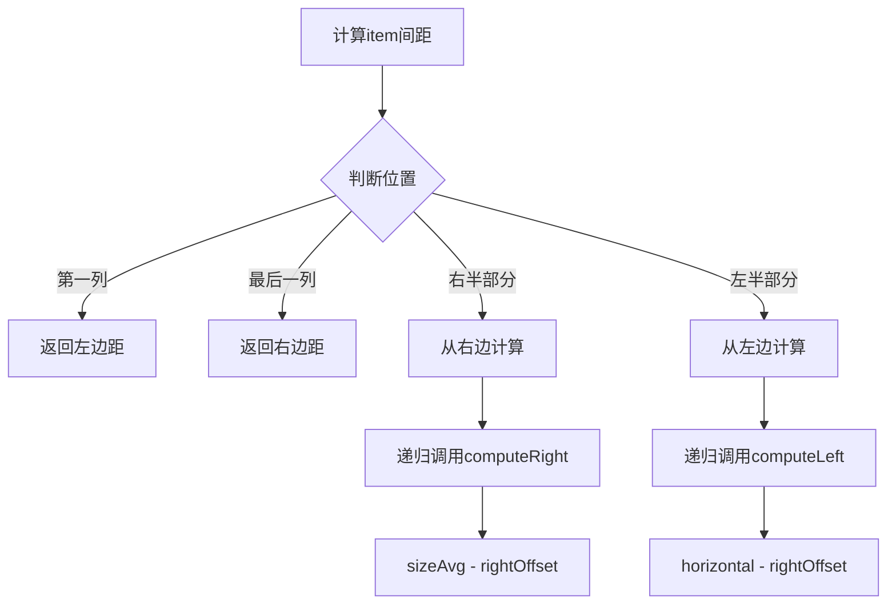

# 🌟 GridSpaceDecoration 详细使用指南

## 📋 目录

1. [概述](#概述)
2. [核心算法原理](#核心算法原理)
3. [详细代码注释解析](#详细代码注释解析)
4. [使用案例](#使用案例)
5. [最佳实践](#最佳实践)
6. [常见问题](#常见问题)
7. [性能优化](#性能优化)

---

## 🎯 概述

`GridSpaceDecoration` 是一个功能强大的RecyclerView网格间距装饰器，专门为GridLayoutManager设计。它采用了复杂的均分算法来确保所有item的宽度完全一致，同时支持灵活的间距配置。

### 🔧 核心特性

- ✅ **精确的间距控制**：确保所有item宽度完全一致
- ✅ **支持复杂布局**：支持不同spanSize的混合布局
- ✅ **双向滚动支持**：支持垂直和水平两种滚动方向
- ✅ **边距配置**：支持整个网格的外边距设置
- ✅ **高性能算法**：采用递归优化算法，减少计算复杂度

---

## 🧮 核心算法原理

### 📐 间距计算公式

```
sizeAvg = (mHorizontal * (mSpanCount - 1) + mLeft + mRight) / mSpanCount
```

**公式解释：**
- `mHorizontal`：内部水平间距
- `mSpanCount`：网格列数
- `mLeft/mRight`：左右边距
- `sizeAvg`：每个item需要分配的平均间距

### 🔄 递归计算策略



### 🎯 双向计算优化

为了提高计算精度和性能，算法采用双向计算策略：

1. **左半部分**：从左边开始递归计算
2. **右半部分**：从右边开始递归计算
3. **优势**：减少递归深度，避免累积误差

---

## 📝 详细代码注释解析

### 🔧 核心方法：getItemOffsets

```java
@Override
public void getItemOffsets(@NonNull Rect outRect, @NonNull View view,
                           @NonNull RecyclerView parent, @NonNull RecyclerView.State state) {
    
    // 🔄 延迟初始化：只在第一次调用时初始化，避免重复初始化
    if (isFirst) {
        init(parent);  // 初始化GridLayoutManager相关信息
        isFirst = false;  // 标记已初始化，后续调用不再初始化
    }
    
    // 🧭 根据GridLayoutManager的方向选择不同的处理策略
    if (mManager.getOrientation() == LinearLayoutManager.VERTICAL) {
        // 垂直滚动：item从上到下排列，需要计算左右间距
        handleVertical(outRect, view, parent, state);
    } else {
        // 水平滚动：item从左到右排列，需要计算上下间距
        handleHorizontal(outRect, view, parent, state);
    }
}
```

### 🧮 左间距计算算法

```java
private int computeLeft(int spanIndex, int sizeAvg) {
    // 🎯 边界情况：第一列直接返回左边距
    if (spanIndex == 0) {
        return mLeft;
    } 
    // 🔄 优化策略：对于右半部分的列，从右边开始计算（减少递归深度）
    else if (spanIndex >= mSpanCount / 2) {
        // 从右边算起：左间距 = 平均间距 - 右间距
        // 这样可以避免累积误差，提高计算精度
        return sizeAvg - computeRight(spanIndex, sizeAvg);
    } 
    // 🔄 标准情况：从左边开始递归计算
    else {
        // 从左边算起：当前列的左间距 = 内部间距 - 前一列的右间距
        // 这确保了相邻两列之间的总间距等于mHorizontal
        return mHorizontal - computeRight(spanIndex - 1, sizeAvg);
    }
}
```

### 🎯 垂直布局处理

```java
private void handleVertical(Rect outRect, View view, RecyclerView parent,
                            RecyclerView.State state) {
    
    // 📋 获取item的布局参数，包含span相关信息
    GridLayoutManager.LayoutParams lp = (GridLayoutManager.LayoutParams) view.getLayoutParams();
    
    // 📍 获取item在adapter中的位置
    int childPos = parent.getChildAdapterPosition(view);
    
    // 🧮 计算每个item需要分配的平均间距
    // 公式：(总的水平间距 + 左右边距) / 列数
    // 这确保了所有item的宽度完全一致
    int sizeAvg = (int) ((mHorizontal * (mSpanCount - 1) + mLeft + mRight) * 1f / mSpanCount);
    
    // 📏 获取当前item的span信息
    int spanSize = lp.getSpanSize();    // item占用的列数
    int spanIndex = lp.getSpanIndex();  // item在当前行的起始列索引
    
    // 🔧 计算左间距：使用复杂的递归算法确保精确分配
    outRect.left = computeLeft(spanIndex, sizeAvg);
    
    // 🔧 计算右间距：需要考虑item的spanSize
    if (spanSize == 0 || spanSize == mSpanCount) {
        // 特殊情况：item占满整行，右间距 = 平均间距 - 左间距
        outRect.right = sizeAvg - outRect.left;
    } else {
        // 普通情况：计算item结束位置的右间距
        outRect.right = computeRight(spanIndex + spanSize - 1, sizeAvg);
    }
    
    // 🔧 计算垂直间距：相对简单，直接平分
    outRect.top = mVertical / 2;     // 上间距为垂直间距的一半
    outRect.bottom = mVertical / 2;  // 下间距为垂直间距的一半
    
    // 🎯 特殊处理：第一行和最后一行
    if (isFirstRaw(childPos)) {
        outRect.top = mTop;  // 第一行使用顶部边距
    }
    if (isLastRaw(childPos)) {
        outRect.bottom = mBottom;  // 最后一行使用底部边距
    }
}
```

---

## 🎨 使用案例

### 📱 案例1：基础网格布局

```java
/**
 * 🎯 场景1：基础网格布局
 * 
 * 演示最简单的网格间距设置：
 * - 2列网格布局
 * - item之间间距16dp
 * - 无边距
 */
private void setupBasicGrid() {
    // 🏗️ 设置GridLayoutManager
    GridLayoutManager layoutManager = new GridLayoutManager(this, 2);
    recyclerView.setLayoutManager(layoutManager);
    
    // 🎨 添加基础间距装饰器
    int spacing = dpToPx(16); // 16dp间距
    GridSpaceDecoration decoration = new GridSpaceDecoration(spacing, spacing);
    recyclerView.addItemDecoration(decoration);
}
```

### 🎨 案例2：带边距的网格布局

```java
/**
 * 🎨 场景2：带边距的网格布局
 * 
 * 演示带有外边距的网格间距设置：
 * - 2列网格布局
 * - item之间间距16dp
 * - 整个网格的边距24dp
 */
private void setupGridWithMargin() {
    GridLayoutManager layoutManager = new GridLayoutManager(this, 2);
    recyclerView.setLayoutManager(layoutManager);
    
    // 🎨 添加带边距的间距装饰器
    int spacing = dpToPx(16);  // 内部间距16dp
    int margin = dpToPx(24);   // 外边距24dp
    GridSpaceDecoration decoration = new GridSpaceDecoration(
            spacing, spacing,  // 内部水平和垂直间距
            margin, margin,    // 左右边距
            margin, margin     // 上下边距
    );
    recyclerView.addItemDecoration(decoration);
}
```

### 🔧 案例3：复杂网格布局

```java
/**
 * 🔧 场景3：复杂网格布局
 * 
 * 演示包含不同spanSize的复杂网格布局：
 * - 3列网格布局
 * - 包含占1列、2列、3列的不同item
 * - item间距12dp，边距16dp
 */
private void setupComplexGrid() {
    // 🏗️ 设置GridLayoutManager，支持不同spanSize
    GridLayoutManager layoutManager = new GridLayoutManager(this, 3);
    
    // 🎯 设置SpanSizeLookup来处理不同的spanSize
    layoutManager.setSpanSizeLookup(new GridLayoutManager.SpanSizeLookup() {
        @Override
        public int getSpanSize(int position) {
            // 📊 根据数据返回对应的spanSize
            if (position < dataList.size()) {
                return dataList.get(position).spanSize;
            }
            return 1; // 默认占1列
        }
    });
    
    recyclerView.setLayoutManager(layoutManager);
    
    // 🎨 添加复杂布局的间距装饰器
    int spacing = dpToPx(12);  // 内部间距12dp
    int margin = dpToPx(16);   // 外边距16dp
    GridSpaceDecoration decoration = new GridSpaceDecoration(
            spacing, spacing,  // 内部间距
            margin, margin,    // 左右边距
            margin, margin     // 上下边距
    );
    recyclerView.addItemDecoration(decoration);
}
```

### 📱 案例4：响应式网格布局

```java
/**
 * 📱 场景4：响应式网格布局
 * 
 * 演示根据屏幕宽度自动计算列数的响应式网格：
 * - 根据屏幕宽度自动计算列数
 * - 每个item最小宽度120dp
 * - 自适应间距
 */
private void setupResponsiveGrid() {
    // 📏 计算响应式列数
    int spanCount = calculateResponsiveSpanCount();
    
    GridLayoutManager layoutManager = new GridLayoutManager(this, spanCount);
    recyclerView.setLayoutManager(layoutManager);
    
    // 🎨 添加响应式间距装饰器
    int spacing = dpToPx(8);   // 较小的间距
    int margin = dpToPx(12);   // 较小的边距
    GridSpaceDecoration decoration = new GridSpaceDecoration(
            spacing, spacing,
            margin, margin,
            margin, margin
    );
    recyclerView.addItemDecoration(decoration);
}

/**
 * 📏 计算响应式列数
 */
private int calculateResponsiveSpanCount() {
    // 📱 获取屏幕宽度
    DisplayMetrics displayMetrics = getResources().getDisplayMetrics();
    float screenWidthDp = displayMetrics.widthPixels / displayMetrics.density;
    
    // 🎯 每个item最小宽度120dp，间距和边距总共40dp
    float itemMinWidth = 120f;
    float totalMargin = 40f;
    
    // 🧮 计算可容纳的列数
    int spanCount = (int) ((screenWidthDp - totalMargin) / itemMinWidth);
    
    // 🛡️ 确保至少有1列，最多6列
    return Math.max(1, Math.min(spanCount, 6));
}
```

### 🔄 案例5：水平滚动网格布局

```java
/**
 * 🔄 场景5：水平滚动网格布局
 * 
 * 演示水平方向滚动的网格布局：
 * - 水平滚动方向
 * - 3行布局
 * - 特殊的间距处理
 */
private void setupHorizontalGrid() {
    // 🏗️ 设置水平方向的GridLayoutManager
    GridLayoutManager layoutManager = new GridLayoutManager(
            this, 
            3,  // 3行
            GridLayoutManager.HORIZONTAL,  // 水平方向
            false
    );
    recyclerView.setLayoutManager(layoutManager);
    
    // 🎨 添加水平网格的间距装饰器
    int spacing = dpToPx(12);
    int margin = dpToPx(16);
    GridSpaceDecoration decoration = new GridSpaceDecoration(
            spacing, spacing,
            margin, margin,
            margin, margin
    );
    recyclerView.addItemDecoration(decoration);
}
```

---

## 🌟 最佳实践

### 1. 🎯 选择合适的构造函数

```java
// ✅ 简单场景：只需要内部间距
GridSpaceDecoration decoration = new GridSpaceDecoration(16, 16);

// ✅ 中等复杂：需要左右边距
GridSpaceDecoration decoration = new GridSpaceDecoration(16, 16, 24, 24);

// ✅ 完整配置：需要所有方向的边距
GridSpaceDecoration decoration = new GridSpaceDecoration(16, 16, 24, 24, 32, 32);
```

### 2. 📐 dp转px的正确方式

```java
/**
 * 📐 dp转px工具方法
 */
private int dpToPx(int dp) {
    DisplayMetrics metrics = getResources().getDisplayMetrics();
    return (int) (dp * metrics.density);
}

// 使用示例
int spacing = dpToPx(16);  // 16dp转换为px
```

### 3. 🧹 正确清理ItemDecoration

```java
/**
 * 🧹 清除所有ItemDecoration
 */
private void clearItemDecorations() {
    while (recyclerView.getItemDecorationCount() > 0) {
        recyclerView.removeItemDecorationAt(0);
    }
}
```

### 4. 🎯 SpanSizeLookup的正确使用

```java
layoutManager.setSpanSizeLookup(new GridLayoutManager.SpanSizeLookup() {
    @Override
    public int getSpanSize(int position) {
        // 🛡️ 边界检查
        if (position < 0 || position >= dataList.size()) {
            return 1;
        }
        
        // 📊 根据数据返回spanSize
        return dataList.get(position).spanSize;
    }
});
```

---

## ❓ 常见问题

### Q1: 为什么item宽度不一致？

**A:** 这通常是因为：
1. 没有正确设置ItemDecoration
2. item布局中设置了固定宽度
3. 使用了错误的LayoutManager

**解决方案：**
```java
// ✅ 确保item布局使用match_parent
<TextView
    android:layout_width="match_parent"  <!-- 不要使用固定宽度 -->
    android:layout_height="120dp" />

// ✅ 确保使用GridLayoutManager
GridLayoutManager layoutManager = new GridLayoutManager(context, spanCount);
```

### Q2: 间距计算不准确怎么办？

**A:** 检查以下几点：
1. 确保传入的间距值是px而不是dp
2. 检查SpanSizeLookup是否正确实现
3. 确认没有在item布局中设置margin

### Q3: 支持StaggeredGridLayoutManager吗？

**A:** 不支持。GridSpaceDecoration专门为GridLayoutManager设计。如需支持StaggeredGridLayoutManager，需要使用其他装饰器。

### Q4: 如何处理不同高度的item？

**A:** GridSpaceDecoration主要处理水平间距，垂直间距相对简单。对于不同高度的item：
```java
// item布局中使用wrap_content
<TextView
    android:layout_width="match_parent"
    android:layout_height="wrap_content"  <!-- 自适应高度 -->
    android:minHeight="120dp" />          <!-- 设置最小高度 -->
```

---

## ⚡ 性能优化

### 1. 🚀 启用SpanSizeLookup缓存

```java
GridLayoutManager.SpanSizeLookup lookup = layoutManager.getSpanSizeLookup();
lookup.setSpanIndexCacheEnabled(true);  // 启用缓存，提高性能
```

### 2. 💾 缓存计算结果

```java
// 在GridSpaceDecoration中，已经实现了延迟初始化
private boolean isFirst = true;

@Override
public void getItemOffsets(...) {
    if (isFirst) {
        init(parent);  // 只初始化一次
        isFirst = false;
    }
    // ...
}
```

### 3. 🔄 减少重复计算

```java
// 预计算常用值
private int mSizeAvg;

private void init(RecyclerView parent) {
    // ... 其他初始化代码
    
    // 预计算平均间距，避免重复计算
    mSizeAvg = (int) ((mHorizontal * (mSpanCount - 1) + mLeft + mRight) * 1f / mSpanCount);
}
```

---

## 📊 总结

GridSpaceDecoration是一个功能强大且高性能的网格间距装饰器，通过复杂的算法确保了间距的精确性和一致性。正确使用它可以让你的网格布局更加美观和专业。

### 🎯 关键要点

1. **算法精确**：采用递归双向计算，确保间距精确
2. **性能优秀**：延迟初始化和缓存机制，提高性能
3. **功能完整**：支持复杂布局、响应式设计、水平滚动
4. **易于使用**：提供多种构造函数，满足不同需求

### 🚀 推荐使用场景

- ✅ 需要精确控制item宽度的网格布局
- ✅ 包含不同spanSize的复杂网格
- ✅ 需要响应式设计的网格布局
- ✅ 水平滚动的网格布局

通过本指南，你应该能够熟练使用GridSpaceDecoration来创建各种复杂的网格布局了！🎉 