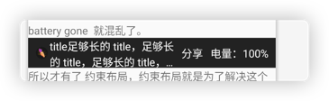
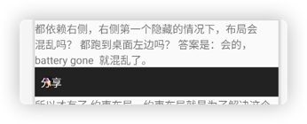
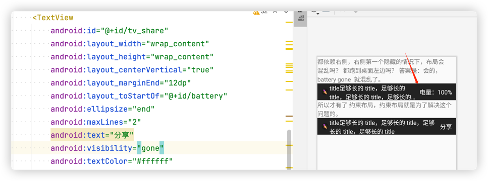

# 各个module 的作用

## 1.app Android drawable的一些小细节，以及让UI提供图片尺寸时，怎样计算尺寸。

## 2. LaunchedApp 和 LaunchOtherApp 一起验证了，从一个 app 启动另一个 app 的方式。


## [NestedScrolling](NestedScrolling) 参考： [Android NestedScrolling机制 - 简书](https://www.jianshu.com/p/aff5e82f0174)

## [CoordinatorLayoutDemo](CoordinatorLayoutDemo) 参考：[CoordinatorLayout 完全解析 - 简书](https://www.jianshu.com/p/4a77ae4cd82f)


---


# Android NestedScrolling机制

#### onNestedPreScroll

```Java
    /**
     * React to a nested scroll in progress before the target view consumes a portion of the scroll.
     *
     * <p>When working with nested scrolling often the parent view may want an opportunity
     * to consume the scroll before the nested scrolling child does. An example of this is a
     * drawer that contains a scrollable list. The user will want to be able to scroll the list
     * fully into view before the list itself begins scrolling.</p>
     *
     * <p><code>onNestedPreScroll</code> is called when a nested scrolling child invokes
     * {@link View#dispatchNestedPreScroll(int, int, int[], int[])}. The implementation should
     * report how any pixels of the scroll reported by dx, dy were consumed in the
     * <code>consumed</code> array. Index 0 corresponds to dx and index 1 corresponds to dy.
     * This parameter will never be null. Initial values for consumed[0] and consumed[1]
     * will always be 0.</p>
     *
     * @param target View that initiated the nested scroll
     * @param dx Horizontal scroll distance in pixels
     * @param dy Vertical scroll distance in pixels
     * @param consumed Output. The horizontal and vertical scroll distance consumed by this parent
     */
    void onNestedPreScroll(@NonNull View target, int dx, int dy, @NonNull int[] consumed);

```
翻译：
```
在目标视图消耗滚动的一部分之前，对正在进行的嵌套滚动做出反应。

经常使用嵌套滚动时，父视图可能希望有机会在嵌套滚动子级之前使用滚动。
这方面的一个示例是包含可滚动列表的抽屉。 用户将希望能够在列表本身开始滚动之前将列表完全滚动到视图中。


onNestedPreScroll在嵌套滚动子调用View.dispatchNestedPreScroll(int, int, int[], int[])时被调用。 
实现应该报告 dx, dy 报告的任何滚动像素如何在consumed数组中被消费。 
索引 0 对应于 dx，索引 1 对应于 dy。 此参数永远不会为空。 消费[0] 和消费[1] 的初始值将始终为 0。

    参数：
    target - 启动嵌套滚动的视图
    dx – 水平滚动距离（以像素为单位）
    dy – 垂直滚动距离（以像素为单位）
    消耗——输出。 此父级消耗的水平和垂直滚动距离
```
 父视图可能希望有机会在嵌套滚动子级之前使用滚动


####  Behavior

CoodinatorLayout 并不知道 FloatingActionButton 和 AppBarLayout 的工作原理，我们提到过 CoodinatorLayout 实现了 NestedScrollingParent，我们通过一个实现了 NestedScrollingChild 的 scrolling view，就可以轻松的实现：滑动事件的处理与 View 之间的交互。

这其中充当中间桥梁的就是 CoordinatorLayout.Behavior，比如 FloatingActionButton，查看源码发现它的类注解是这样的：

```kotlin
@CoordinatorLayout.DefaultBehavior(FloatingActionButton.Behavior.class)
public class FloatingActionButton extends VisibilityAwareImageButton {
    // ...
}

```

FloatingActionButton.Behavior 的主要作用就是防止被 Snackbar 盖住。

自定义 View 既可以通过注解指定 Behavior，也可以通过在布局 XML 申明：

```bash
app:layout_behavior="具体Behavior的类路径"
```

---


# canvas save restore 

## 1  canvas 
```Java
      Paint paint_green = new Paint();
        paint_green.setColor(Color.GREEN);
        Paint paint_red   =  new Paint();
        paint_red.setColor(Color.RED);

        Rect rect1 = new Rect(300,10,500,100);
        canvas.drawRect(rect1, paint_red); //画出原轮廓

        canvas.rotate(30);//顺时针旋转画布
        canvas.drawRect(rect1, paint_green);//画出旋转后的矩形
```


## 2 save  restore
``` Java
        Paint paint_green = new Paint();
        paint_green.setColor(Color.GREEN);
        Paint paint_red   =  new Paint();
        paint_red.setColor(Color.RED);

        Rect rect1 = new Rect(300,10,500,100);
        canvas.drawRect(rect1, paint_red); //画出原轮廓

        canvas.save(); // 保存当前未旋转状态

        canvas.rotate(30);//顺时针旋转画布
        canvas.restore();  // 恢复之前保存的画布状态，那么就看不到"canvas.rotate(30)"的效果
        canvas.drawRect(rect1, paint_green);//画出旋转后的矩形
```


> PS中的图层可谓PS的精华，它保证了在一个图层中绘制而不会影响到其他的图层
在Canvas中每次的save()都存将先前的状态保存下来，产生一个新的绘图层，
我们可以随心所欲地地画而不会影响其他已画好的图，最后用restore()将这个图层合并到原图层
这像是栈的概念，每次save()，新图层入栈(注意可以save多次)，只有栈顶的层可以进行操作，restore()弹栈


[Android关于Canvas你所知道的和不知道的一切 - 掘金](https://juejin.cn/post/6844903705930629128#heading-21)

## 3 translate
```Java
 Paint paint_green = new Paint();
        paint_green.setColor(Color.GREEN);
        Paint paint_red   =  new Paint();
        paint_red.setColor(Color.RED);

        Rect rect1 = new Rect(300,10,500,100);
        canvas.drawRect(rect1, paint_red); //画出原轮廓

        canvas.save(); // 保存当前未旋转状态

        canvas.rotate(30);//顺时针旋转画布
        canvas.restore();  // 恢复之前保存的画布状态，那么就看不到"canvas.rotate(30)"的效果

        canvas.translate(100,100);
        canvas.drawRect(rect1, paint_green);//画出旋转后的矩形
```


我们看到红色的矩形并没有跟随发生旋转,所以说我们的canvas并不是我们看到的屏幕.刚才我们说canvas是一个静态缓冲层,缓冲层已经证明了,那么为什么说是静态的呢?说canvas是静态是因为它发生变换(包括位移,旋转,切割,放缩,斜切)后是不可逆的,假如说我们执行了canvas.translate()方法让canvas向右平移100个像素,那么我们之后对canvas的所有绘画动作都是基于它位移过后的位置.

那么我们如何在一次canvas变换后重新得到初始状态的canvas呢,我们可以使用canvas.save()保存canvas状态,使用canvas.restore()来取回canvas.我们这里主要说的是canvas.save()和canvas.restore()的保存和取回规则.我们可以这样认为,调用canvas.save()方法我们将一个canvas实例放进了一个栈中,调用canvas.restore()方法是将一个canvas实例从栈中取出,我们知道栈的特点是后进先出,所以当我们多次调用canvas.save()方法后,再调用canvas.restore()方法,我们取出的是最后一个存入栈中的canvas实例,如果继续调用canvas.restore()我们得到的是倒数第二个存入栈中的canvas实例.


---

# 手势    GestureDetector 

 , https://www.yuque.com/zhangxc/mrevrs/175b1225-f6c9-4437-96bd-18e1f3754d1d


---


<a name="90c29e9b"></a>
# 是Android  URL Scheme deeplink


---

### 1. 什么是Android  URL Scheme？

简单的说就是android中的一种页面内跳转协议，方便app页面的内的跳转

<a name="86221628"></a>

### 2.什么时候使用

1. 服务器下发跳转路径，客户端根据 服务器下发跳转路径跳转相应的页面
2. H5页面点击描点，根据描点具体跳转路径APP端跳转具体的页面
3. APP端收到服务器端下发的PUSH通知栏消息，根据消息的点击跳转路径跳转相关页面
4. APP根据URL跳转到另外一个APP指定页面

<a name="cba9303a"></a>

### 3.协议格式

```properties
mobi://seachal.me:9999/macthDetail?macthId=222&time=10001
```

| scheme | 代表该Schema 协议名称      | scmobi                  |
| ------ | -------------------------- | ----------------------- |
| host   | 代表Schema作用于哪个地址域 | seachal.me              |
| port   | 代表该路径的端口号         | 9999                    |
| path   | 代表Schema指定的页面       | /macthDetail            |
| --     | 代表传递的参数             | ?macthId=222&time=10001 |


<a name="b1495ac5"></a>

### 4.在app中如何使用

在AndroidManifest.xml中对**activity**标签增加**intent-filter**设置**Schema**

```properties
 <activity android:name=".SecondActivity">
            <intent-filter>
                <action android:name="android.intent.action.VIEW"/>
                <category android:name="android.intent.category.DEFAULT"/>
                <category android:name="android.intent.category.BROWSABLE"/>
                <data android:scheme="scmobi"
                    android:host="seachal.me"
                    android:port="9999"
                    android:path="/macthDetail"
                    />

            </intent-filter>

        </activity>
```

注意：

```properties
<action android:name="android.intent.action.VIEW"/>
<category android:name="android.intent.category.DEFAULT"/>
<category android:name="android.intent.category.BROWSABLE"/>
```

<a name="13b7073a"></a>

### 5.如何调用

**1.在html中调用非常简单**

```properties
<a href="scmobi://seachal.me:9999/macthDetail?macthId=222&time=10001">打开源生应用指定的页面</a>
```

**2.在源生应用中调用也很简单**

```properties
Intent intent = new Intent(Intent.ACTION_VIEW,Uri.parse("scmobi://seachal.me:9999/macthDetail?macthId=222&time=10001"));
startActivity(intent);
```

<a name="8757017f"></a>

### 6.在原生界面获取uri和各个参数

```properties
 Intent intent = getIntent();
        Uri data = intent.getData();  //
        String action = intent.getAction();
        String scheme = intent.getScheme();
        Set<String> categories = intent.getCategories();
        Log.e("TAG", "data==========="+data);
        Log.e("TAG", "action==========="+action);
        Log.e("TAG", "categories==========="+categories);
        Log.e("TAG", "DataString==========="+intent.getDataString());
        Log.e("TAG", "==============================");
        Log.e("TAG", "scheme==========="+scheme);
        Log.e("TAG", "id ==========="+data.getQueryParameterNames());
        Log.e("TAG", "host==========="+data.getHost());
        Log.e("TAG", "path==========="+data.getPath());
        Log.e("TAG", "port==========="+data.getPort());
```

输出结果

```properties
4-11 18:13:56.335 5198-5198/com.phone.myapplication E/TAG: data===========scmobi://seachal.me:9999/macthDetail?goodsId=10011002&time=1111
04-11 18:13:56.335 5198-5198/com.phone.myapplication E/TAG: action===========android.intent.action.VIEW
04-11 18:13:56.335 5198-5198/com.phone.myapplication E/TAG: categories===========null
04-11 18:13:56.335 5198-5198/com.phone.myapplication E/TAG: DataString===========scmobi://seachal.me:9999/macthDetail?goodsId=10011002&time=1111
04-11 18:13:56.335 5198-5198/com.phone.myapplication E/TAG: ==============================
04-11 18:13:56.335 5198-5198/com.phone.myapplication E/TAG: scheme===========scmobi
04-11 18:13:56.335 5198-5198/com.phone.myapplication E/TAG: id ===========[goodsId, time]
04-11 18:13:56.335 5198-5198/com.phone.myapplication E/TAG: host===========seachal.me
04-11 18:13:56.335 5198-5198/com.phone.myapplication E/TAG: path===========/macthDetail
04-11 18:13:56.335 5198-5198/com.phone.myapplication E/TAG: port===========9999
```

具体含义可以对比传入的参数

<a name="18556a4d"></a>

### 7. 判断Schema是否有效

判断Schema是否有效，也可以说判断应用是否安装（在确定要启动的应用已经配置了scheme）

app源生判断Sheme是否有效

```properties
Intent intent = new Intent(Intent.ACTION_VIEW, Uri.parse("scmobi://seachal.me:9999/macthDetail?macthId=222&time=10001"));

List<ResolveInfo> activities =getpackageManager().queryIntentActivities(intent, 0);
boolean isValid = !activities.isEmpty();
Toast.makeText(this,isValid+"",Toast.LENGTH_LONG).show();
```

也可以用 apb  命令试试

```
adb shell am start -W -a "android.intent.action.VIEW" -d "yourUri" yourPackageName
```

参考链接： [Scheme协议详细介绍 - 简书](https://www.jianshu.com/p/49b11da1f0a9)<br />[Android 中Scheme协议的使用详解 - 掘金](https://juejin.cn/post/7080492841872392229)<br />[腾讯开放平台 OPEN.QQ.COM](https://wikinew.open.qq.com/index.html#/iwiki/4007776119)<br />[Android 开发者  |  Android Developers](https://developer.android.com/guide/topics/manifest/data-element?hl=zh-cn#:~:text=android%3Ascheme%20The%20scheme%20part%20of%20a%20URI.%20This,trailing%20colon%2C%20such%20as%20http%20rather%20than%20http%3A.)


---

<a name="CNwlV"></a>

## 提一个问题，

<a name="kB63Z"></a>

### 1  如果启动方填写的"地址"信息更详细

如果之前启动方的链接是 'sc://seachal.me'<br />现在更新链接为 'sc://seachal.me/macthDetail?macthId=222&time=10001',

被启动方不变：

```
      <data
                        android:host="seachal.me"
                        android:scheme="sc" />
```

新链接可以启动吗？  答案是可以启动。

```
    public void startOtherAppActivity12_1(View view) {

        Intent intent = new Intent(Intent.ACTION_VIEW, Uri.parse("sc://seachal.me"));
        List<ResolveInfo> activities = getPackageManager().queryIntentActivities(intent, 0);
        boolean isValid = !activities.isEmpty();
        Toast.makeText(this,isValid+"",Toast.LENGTH_LONG).show();

        try {
            if (isValid) {
                startActivity(intent);
            } else {
                Toast.makeText(this,"没有安装",Toast.LENGTH_LONG).show();
            }
        } catch (Exception e) {
            Toast.makeText(getApplicationContext(), "可以在这里提示用户没有找到应用程序，或者是做其他的操作！", Toast.LENGTH_LONG).show();
        }
    }
```

```
    public void startOtherAppActivity12_2(View view) {

       Intent intent = new Intent(Intent.ACTION_VIEW, Uri.parse("sc://seachal.me/macthDetail?macthId=222&time=10001"));
        List<ResolveInfo> activities = getPackageManager().queryIntentActivities(intent, 0);
        boolean isValid = !activities.isEmpty();
        Toast.makeText(this,isValid+"",Toast.LENGTH_LONG).show();
        try {
            if (isValid) {
                startActivity(intent);
            } else {
                Toast.makeText(this,"没有安装",Toast.LENGTH_LONG).show();
            }
        } catch (Exception e) {
            Toast.makeText(getApplicationContext(), "可以在这里提示用户没有找到应用程序，或者是做其他的操作！", Toast.LENGTH_LONG).show();
        }
    }
```

被启动的 app 的配置

```
        <activity
            android:name=".Main61Activity"
            android:exported="true">

                <!--Android 接收外部跳转过滤器-->
                <intent-filter>
                    <action android:name="android.intent.action.VIEW" />
                    <category android:name="android.intent.category.DEFAULT" />
                    <category android:name="android.intent.category.BROWSABLE" />
                    <!-- 协议部分配置 ,要在web配置相同的-->
                    <!--            sc://seachal.me/macthDetail?macthId=222&time=10001-->
                    <data
                        android:host="seachal.me"
                        android:scheme="sc" />
                </intent-filter>
        </activity>
```

startOtherAppActivity12_1  和 startOtherAppActivity12_2 都可以启动Main61Activity。

<a name="XDcwJ"></a>

## 2   如果启动方填写"地址"的信息更少

如果

```
      <data
                        android:host="seachal.me"
                        android:scheme="sc" />
```

更新一下成为

```
   <data
                    android:host="seachal.me"
                    android:scheme="sc"
                    android:path="/macthDetail"
                    />
```

startOtherAppActivity12_1   无法启动Main61Activity<br /> startOtherAppActivity12_2 可以启动Main61Activity。

<a name="CVVEj"></a>

### 总结


通过上面的两个例子可以得到。 <br />启动方 uri scheme 可以设置的特别详细， 可以有荣誉信息， 只要它包含别启动方的 Scheme 就可以。<br />如果被启动方缺少被启动方的一些时他就启动不了了。

例如我们平时寄快递。 <br />如果寄件地址写：北京市海淀区双榆树街道湖北大厦 101 室。   但是收件人的地址是：北京市海淀区双榆树街道湖北大厦。因为信息足够全，不会错投。 <br />如果寄件地址写：北京市海淀区双榆树街道湖北大厦，但是收件人地址：北京市海淀区双榆树街道湖北大厦 1001 室（10楼）。 因为缺少了一些地址信息，送件的时候，到了湖北大厦不知道给谁了。


---

# 一个布局依赖混乱的问题


都依赖右侧，右侧第一个隐藏的情况下，布局会混乱吗？ 都跑到桌面左边吗？
答案是：会的，battery gone  就混乱了




如上图。  相对布局，假如最右边的设置gone后， 左边两个就会跑到最左边去。

```xml
    <RelativeLayout
        android:id="@+id/layout_top"/>
```




在这两个里面加上

```xml
android:layout_alignWithParentIfMissing="true"
```
就好了~

If set to true, the parent will be used as the anchor when the anchor cannot be be found for layout_toLeftOf, layout_toRightOf, etc. [boolean]

针对RelativeLayout有一点需要注意，因为它内部是通过多个View之间的关系而确定的框架，那么当其中某一个View因为某些需要调用GONE 来完全隐藏掉后，会影响与其相关联的Views。Android为我们提供了一个属性 layout_alignWithParentIfMissing  用于解决类似问题，当某一个View无法找到与其相关联 的Views后将依据alignWithParentIfMissing 的设定判断是否与父级View对齐。

---
如果把右侧倒数第二 2 个 share gone调，布局是不混乱的



## 下一步的整理计划，项目代码的整理

# onActivityResult

```agsl
2023-12-20 15:51:37.827  8182-8182  onActivityResult        com.seachal.seachaltest              D  ContainerActivity: requestCode = 65736, resultCode = -1, data = Intent { cmp=com.seachal.seachaltest/.onActivityResult.SecondBActivity (has extras) }
2023-12-20 15:51:37.827  8182-8182  OnActivityResult        com.seachal.seachaltest              D  OnActivityResultUserFragmentContainerFragment onActivityResult requestCode: 200, resultCode: -1, data: Intent { cmp=com.seachal.seachaltest/.onActivityResult.SecondBActivity (has extras) }
2023-12-20 15:51:37.828  8182-8182  Compatibil...geReporter com.seachal.seachaltest              D  Compat change id reported: 147798919; UID 11366; state: DISABLED
2023-12-20 15:51:37.869  8182-8182  OnActivityResult        com.seachal.seachaltest              D  ContainerFragment requestCode: 200, resultCode: -1, result: Hello FirstActivity

```
通过日志可以看出，从 Fragment 发出 StartActivityForResult, 在 Fragment，是可以收到onActivityResult的


## 我经过测试发现， 即使我不重写onSaveInstanceState， editText在旋转屏幕后也恢复了这是为什么

即使你不重写 onSaveInstanceState() 方法，EditText 控件在旋转屏幕后仍有可能恢复其内容，这是因为从 Android API 级别 11（Android 3.0 Honeycomb）开始，Android 系统默认会对一些常见的视图组件（包括 EditText）执行自动状态保存和恢复的过程。

在系统层面，Android 框架会自动捕获并保存这些组件的基本状态信息，如 EditText 的文本内容。当屏幕方向改变导致 Activity 重建时，系统会根据之前保存的信息自动填充这些视图的状态。

然而，自动保存并不是万无一失的，它只针对一部分内置组件的特定属性，并且只保存基本状态。如果你的应用中存在自定义视图或者需要额外保存非标准状态数据，就需要手动在 onSaveInstanceState() 和 onRestoreInstanceState() 中实现保存和恢复逻辑。

因此，如果你观察到 EditText 的内容在屏幕旋转后能够恢复，很可能是因为你正在使用的 Android 版本和设备支持这一自动状态保存功能，并且你的 EditText 控件拥有一个唯一的 ID（这对于系统识别和恢复其状态至关重要）。如果在老版本或者特殊情况下的自定义需求，仍需手动处理以确保数据安全保存。

# FlexTab 灵动选项卡

<p align="center">
  
  
  
  
</p>

<p align="center">
  
</p>

<p align="center">
  <b>完美契合设计稿的 Android 选项卡控件 | Perfect Design-First Tab Control for Android</b>
</p>

<p align="center">
  <a href="#简介">简介</a> •
  <a href="#特性">特性</a> •
  <a href="#效果展示">效果展示</a> •
  <a href="#安装">安装</a> •
  <a href="#使用方法">使用方法</a> •
  <a href="#自定义选项">自定义选项</a> •
  <a href="#english">English</a> •
  <a href="#license">License</a>
</p>

---

## 简介

**FlexTab** 是一款专为还原设计稿而生的Android选项卡控件。您是否曾因设计师提供的复杂选项卡设计而头疼？传统Tab组件总是难以精确还原设计稿中的指示器效果？FlexTab让这一切变得简单！

> 💡 完美支持任意图片作为指示器，无需复杂绘制代码，告别难以还原的设计！

## 特性

- ✨ **设计优先** - 直接使用设计稿中的图片资源作为指示器
- 🎨 **零偏差还原** - 精确实现设计师的视觉效果，无需复杂的自定义绘制
- 🔄 **ViewPager2支持** - 与ViewPager2无缝集成，实现流畅的页面滑动
- 📐 **灵活布局** - 支持固定宽度或自适应宽度的指示器
- 🖼️ **图片指示器** - 轻松使用任意图片作为指示器，包括不规则形状
- 🎯 **精确定位** - 智能计算确保指示器位置精确
- 🚀 **高性能** - 基于RecyclerView实现，滚动性能优异
- 👆 **流畅动画** - 平滑的指示器过渡动画

## 效果展示

<p align="center">
  
  
  
</p>

## 安装

### Gradle

在项目级 build.gradle 中添加:

```gradle
allprojects {
    repositories {
        ...
        maven { url 'https://jitpack.io' }
    }
}
```

在应用级 build.gradle 中添加:

```gradle
dependencies {
    implementation 'com.github.seachal:FlexTab:1.0.0'
}
```

## 使用方法

### 基础用法

在XML布局中添加:

```xml
<com.seachal.flextab.CustomTabLayout
    android:id="@+id/customTabLayout"
    android:layout_width="match_parent"
    android:layout_height="48dp"
    android:background="#FFFFFF"
    app:o_selectedTextColor="#FF5722"
    app:o_normalTextColor="#666666" />
```

在Activity或Fragment中:

```java
// 设置Tab数据
List<String> tabTitles = Arrays.asList("标签1", "标签2", "标签3");
customTabLayout.setTabItems(tabTitles);

// 设置指示器图片（直接使用设计稿中的图片）
customTabLayout.setIndicatorDrawable(
    ContextCompat.getDrawable(this, R.drawable.your_indicator_image));

// 设置指示器尺寸
customTabLayout.setIndicatorSize(
    getResources().getDimensionPixelSize(R.dimen.indicator_width),
    getResources().getDimensionPixelSize(R.dimen.indicator_height));

// 关联ViewPager2
customTabLayout.setupWithViewPager2(viewPager);
```

### 与ViewPager2集成

```java
// 设置ViewPager2适配器
viewPager.setAdapter(new FragmentStateAdapter(this) {
    @NonNull
    @Override
    public Fragment createFragment(int position) {
        return fragments.get(position);
    }

    @Override
    public int getItemCount() {
        return fragments.size();
    }
});

// 关联TabLayout和ViewPager2
customTabLayout.setupWithViewPager2(viewPager);
```

## 自定义选项

### XML属性

| 属性 | 描述 | 默认值 |
|------|------|--------|
| `o_indicatorDrawable` | 指示器图片资源 | 无 |
| `o_indicatorColor` | 指示器颜色（当使用默认绘制时） | colorAccent |
| `o_indicatorHeight` | 指示器高度 | 4dp |
| `o_indicatorWidthMode` | 指示器宽度模式(0:固定, 1:随文本) | 1 |
| `o_indicatorFixedWidth` | 指示器固定宽度 | 20dp |
| `o_indicatorRadius` | 指示器圆角半径 | 2dp |
| `o_selectedTextColor` | 选中文本颜色 | colorAccent |
| `o_normalTextColor` | 普通文本颜色 | #000000 |

### 自定义指示器工厂

如果您需要更复杂的指示器效果，可以实现自定义指示器工厂：

```java
// 创建自定义指示器工厂
customTabLayout.setIndicatorFactory(new TabIndicatorFactory() {
    @Override
    public TabIndicator createTabIndicator() {
        return new YourCustomIndicator();
    }
});

// 自定义指示器实现
class YourCustomIndicator implements TabIndicator {
    // 实现接口方法...
}
```

## 贡献指南

欢迎提交Issue和Pull Request。请确保您的PR符合以下要求：

1. 代码风格与项目保持一致
2. 新特性包含适当的测试和文档
3. 提交信息清晰明了

## 更新日志

**v1.0.0** (2024-05-30)
- 首次发布
- 支持图片指示器
- ViewPager2集成
- 自定义指示器工厂

---

<h1 id="english">FlexTab</h1>

<p align="center">
  <b>The Perfect Design-First Tab Control for Android</b>
</p>

## Introduction

**FlexTab** is an Android tab control specifically designed to perfectly match design mockups. Have you ever struggled with complex tab indicator designs from your designers? Traditional tab components often fail to accurately reproduce the indicator effects in design mockups. FlexTab makes this simple!

> 💡 Perfect support for any image as an indicator without complex drawing code!

## Features

- ✨ **Design First** - Use image assets directly from design mockups as indicators
- 🎨 **Perfect Reproduction** - Accurately implement the designer's visual effects without complex custom drawing
- 🔄 **ViewPager2 Support** - Seamless integration with ViewPager2 for smooth page sliding
- 📐 **Flexible Layout** - Support for fixed width or adaptive width indicators
- 🖼️ **Image Indicators** - Easily use any image as an indicator, including irregular shapes
- 🎯 **Precise Positioning** - Smart calculations ensure precise indicator positioning
- 🚀 **High Performance** - Implemented based on RecyclerView for excellent scrolling performance
- 👆 **Smooth Animations** - Smooth indicator transition animations

## Installation

### Gradle

Add to your project level build.gradle:

```gradle
allprojects {
    repositories {
        ...
        maven { url 'https://jitpack.io' }
    }
}
```

Add to your app level build.gradle:

```gradle
dependencies {
    implementation 'com.github.seachal:FlexTab:1.0.0'
}
```

## Basic Usage

In your XML layout:

```xml
<com.seachal.flextab.CustomTabLayout
    android:id="@+id/customTabLayout"
    android:layout_width="match_parent"
    android:layout_height="48dp"
    android:background="#FFFFFF"
    app:o_selectedTextColor="#FF5722"
    app:o_normalTextColor="#666666" />
```

In your Activity or Fragment:

```java
// Set tab data
List<String> tabTitles = Arrays.asList("Tab 1", "Tab 2", "Tab 3");
customTabLayout.setTabItems(tabTitles);

// Set indicator image (directly use image from design)
customTabLayout.setIndicatorDrawable(
    ContextCompat.getDrawable(this, R.drawable.your_indicator_image));

// Set indicator size
customTabLayout.setIndicatorSize(
    getResources().getDimensionPixelSize(R.dimen.indicator_width),
    getResources().getDimensionPixelSize(R.dimen.indicator_height));

// Connect with ViewPager2
customTabLayout.setupWithViewPager2(viewPager);
```

## License

```
MIT License

Copyright (c) 2024 Seachal

Permission is hereby granted, free of charge, to any person obtaining a copy
of this software and associated documentation files (the "Software"), to deal
in the Software without restriction, including without limitation the rights
to use, copy, modify, merge, publish, distribute, sublicense, and/or sell
copies of the Software, and to permit persons to whom the Software is
furnished to do so, subject to the following conditions:

The above copyright notice and this permission notice shall be included in all
copies or substantial portions of the Software.

THE SOFTWARE IS PROVIDED "AS IS", WITHOUT WARRANTY OF ANY KIND, EXPRESS OR
IMPLIED, INCLUDING BUT NOT LIMITED TO THE WARRANTIES OF MERCHANTABILITY,
FITNESS FOR A PARTICULAR PURPOSE AND NONINFRINGEMENT. IN NO EVENT SHALL THE
AUTHORS OR COPYRIGHT HOLDERS BE LIABLE FOR ANY CLAIM, DAMAGES OR OTHER
LIABILITY, WHETHER IN AN ACTION OF CONTRACT, TORT OR OTHERWISE, ARISING FROM,
OUT OF OR IN CONNECTION WITH THE SOFTWARE OR THE USE OR OTHER DEALINGS IN THE
SOFTWARE.