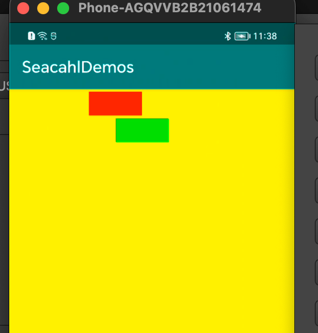

# 各个module 的作用

## 1.app Android drawable的一些小细节，以及让UI提供图片尺寸时，怎样计算尺寸。

## 2. LaunchedApp 和 LaunchOtherApp 一起验证了，从一个 app 启动另一个 app 的方式。


## [NestedScrolling](NestedScrolling) 参考： [Android NestedScrolling机制 - 简书](https://www.jianshu.com/p/aff5e82f0174)

## [CoordinatorLayoutDemo](CoordinatorLayoutDemo) 参考：[CoordinatorLayout 完全解析 - 简书](https://www.jianshu.com/p/4a77ae4cd82f)


### Android NestedScrolling机制

#### onNestedPreScroll

```Java
    /**
     * React to a nested scroll in progress before the target view consumes a portion of the scroll.
     *
     * <p>When working with nested scrolling often the parent view may want an opportunity
     * to consume the scroll before the nested scrolling child does. An example of this is a
     * drawer that contains a scrollable list. The user will want to be able to scroll the list
     * fully into view before the list itself begins scrolling.</p>
     *
     * <p><code>onNestedPreScroll</code> is called when a nested scrolling child invokes
     * {@link View#dispatchNestedPreScroll(int, int, int[], int[])}. The implementation should
     * report how any pixels of the scroll reported by dx, dy were consumed in the
     * <code>consumed</code> array. Index 0 corresponds to dx and index 1 corresponds to dy.
     * This parameter will never be null. Initial values for consumed[0] and consumed[1]
     * will always be 0.</p>
     *
     * @param target View that initiated the nested scroll
     * @param dx Horizontal scroll distance in pixels
     * @param dy Vertical scroll distance in pixels
     * @param consumed Output. The horizontal and vertical scroll distance consumed by this parent
     */
    void onNestedPreScroll(@NonNull View target, int dx, int dy, @NonNull int[] consumed);

```
翻译：
```
在目标视图消耗滚动的一部分之前，对正在进行的嵌套滚动做出反应。

经常使用嵌套滚动时，父视图可能希望有机会在嵌套滚动子级之前使用滚动。
这方面的一个示例是包含可滚动列表的抽屉。 用户将希望能够在列表本身开始滚动之前将列表完全滚动到视图中。


onNestedPreScroll在嵌套滚动子调用View.dispatchNestedPreScroll(int, int, int[], int[])时被调用。 
实现应该报告 dx, dy 报告的任何滚动像素如何在consumed数组中被消费。 
索引 0 对应于 dx，索引 1 对应于 dy。 此参数永远不会为空。 消费[0] 和消费[1] 的初始值将始终为 0。

    参数：
    target - 启动嵌套滚动的视图
    dx – 水平滚动距离（以像素为单位）
    dy – 垂直滚动距离（以像素为单位）
    消耗——输出。 此父级消耗的水平和垂直滚动距离
```
 父视图可能希望有机会在嵌套滚动子级之前使用滚动


####  Behavior

CoodinatorLayout 并不知道 FloatingActionButton 和 AppBarLayout 的工作原理，我们提到过 CoodinatorLayout 实现了 NestedScrollingParent，我们通过一个实现了 NestedScrollingChild 的 scrolling view，就可以轻松的实现：滑动事件的处理与 View 之间的交互。

这其中充当中间桥梁的就是 CoordinatorLayout.Behavior，比如 FloatingActionButton，查看源码发现它的类注解是这样的：

```kotlin
@CoordinatorLayout.DefaultBehavior(FloatingActionButton.Behavior.class)
public class FloatingActionButton extends VisibilityAwareImageButton {
    // ...
}

```

FloatingActionButton.Behavior 的主要作用就是防止被 Snackbar 盖住。

自定义 View 既可以通过注解指定 Behavior，也可以通过在布局 XML 申明：

```bash
app:layout_behavior="具体Behavior的类路径"
```


## canvas save restore 
```Java
      Paint paint_green = new Paint();
        paint_green.setColor(Color.GREEN);
        Paint paint_red   =  new Paint();
        paint_red.setColor(Color.RED);

        Rect rect1 = new Rect(300,10,500,100);
        canvas.drawRect(rect1, paint_red); //画出原轮廓

        canvas.rotate(30);//顺时针旋转画布
        canvas.drawRect(rect1, paint_green);//画出旋转后的矩形
```


2 save  restore
``` Java
        Paint paint_green = new Paint();
        paint_green.setColor(Color.GREEN);
        Paint paint_red   =  new Paint();
        paint_red.setColor(Color.RED);

        Rect rect1 = new Rect(300,10,500,100);
        canvas.drawRect(rect1, paint_red); //画出原轮廓

        canvas.save(); // 保存当前未旋转状态

        canvas.rotate(30);//顺时针旋转画布
        canvas.restore();  // 恢复之前保存的画布状态，那么就看不到"canvas.rotate(30)"的效果
        canvas.drawRect(rect1, paint_green);//画出旋转后的矩形
```


> PS中的图层可谓PS的精华，它保证了在一个图层中绘制而不会影响到其他的图层
在Canvas中每次的save()都存将先前的状态保存下来，产生一个新的绘图层，
我们可以随心所欲地地画而不会影响其他已画好的图，最后用restore()将这个图层合并到原图层
这像是栈的概念，每次save()，新图层入栈(注意可以save多次)，只有栈顶的层可以进行操作，restore()弹栈


[Android关于Canvas你所知道的和不知道的一切 - 掘金](https://juejin.cn/post/6844903705930629128#heading-21)

3 translate
```Java
 Paint paint_green = new Paint();
        paint_green.setColor(Color.GREEN);
        Paint paint_red   =  new Paint();
        paint_red.setColor(Color.RED);

        Rect rect1 = new Rect(300,10,500,100);
        canvas.drawRect(rect1, paint_red); //画出原轮廓

        canvas.save(); // 保存当前未旋转状态

        canvas.rotate(30);//顺时针旋转画布
        canvas.restore();  // 恢复之前保存的画布状态，那么就看不到"canvas.rotate(30)"的效果

        canvas.translate(100,100);
        canvas.drawRect(rect1, paint_green);//画出旋转后的矩形
```


我们看到红色的矩形并没有跟随发生旋转,所以说我们的canvas并不是我们看到的屏幕.刚才我们说canvas是一个静态缓冲层,缓冲层已经证明了,那么为什么说是静态的呢?说canvas是静态是因为它发生变换(包括位移,旋转,切割,放缩,斜切)后是不可逆的,假如说我们执行了canvas.translate()方法让canvas向右平移100个像素,那么我们之后对canvas的所有绘画动作都是基于它位移过后的位置.

那么我们如何在一次canvas变换后重新得到初始状态的canvas呢,我们可以使用canvas.save()保存canvas状态,使用canvas.restore()来取回canvas.我们这里主要说的是canvas.save()和canvas.restore()的保存和取回规则.我们可以这样认为,调用canvas.save()方法我们将一个canvas实例放进了一个栈中,调用canvas.restore()方法是将一个canvas实例从栈中取出,我们知道栈的特点是后进先出,所以当我们多次调用canvas.save()方法后,再调用canvas.restore()方法,我们取出的是最后一个存入栈中的canvas实例,如果继续调用canvas.restore()我们得到的是倒数第二个存入栈中的canvas实例.


---

手势    GestureDetector  , https://www.yuque.com/zhangxc/mrevrs/175b1225-f6c9-4437-96bd-18e1f3754d1d