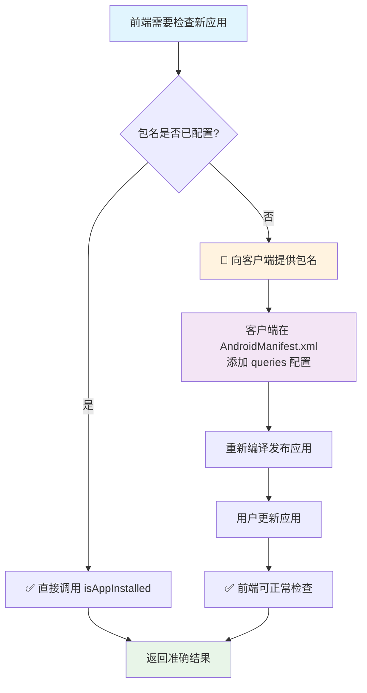

## 应用安装状态检查接口

### 📋 接口总览

| 方法名 | 功能 | 参数 | 返回值 | 推荐度 |
| --- | --- | --- | --- | --- |
| `isWeChatInstalled()` | 检查微信安装状态 | 无 | Boolean | ⭐⭐⭐⭐⭐ |
| `isAppInstalled(packageName)` | 通用应用安装检查 | String | Boolean | ⭐⭐⭐ |
| `isPackageConfigured(packageName)` 🆕 | 检查包名是否已配置 | String | Boolean | ⭐⭐⭐⭐⭐ |
| `getConfiguredPackages()` 🆕 | 获取已配置包名列表 | 无 | String (JSON) | ⭐⭐⭐⭐ |

**⚠️ 重要提醒**: 由于 Android 11+ 包可见性限制，强烈建议前端先调用 `isPackageConfigured()` 验证包名后再使用 `isAppInstalled()`

---

#### 1. 检查微信安装状态
```javascript
isWeChatInstalled()
```

+ **功能**: 检查用户设备是否已安装微信应用
+ **参数**: 无
+ **返回值**: `Boolean` 类型
    - `true`: 已安装微信
    - `false`: 未安装微信

#### 2. 通用应用安装状态检查
```javascript
isAppInstalled(packageName)
```

+ **功能**: 检查指定包名的应用是否已安装
+ **参数**: 
    - `packageName` (String): 应用包名
+ **返回值**: `Boolean` 类型
    - `true`: 已安装该应用
    - `false`: 未安装该应用

#### 🚨 重要限制说明 - Android 11+ 包可见性
**⚠️ 前端开发者必读：**

由于 Android 11 (API level 30) 引入的包可见性限制，`isAppInstalled()` 方法**只能检查已在客户端 AndroidManifest.xml 中声明的应用**。

**如果要检查新的应用，必须遵循以下流程：**

1. **前端开发者**: 向客户端开发者提供需要检查的应用包名
2. **客户端开发者**: 在 `AndroidManifest.xml` 中的 `<queries>` 元素内添加对应包名：
   ```xml
   <queries>
       <!-- 现有的应用声明 -->
       <package android:name="com.tencent.mm" />
       <package android:name="com.tencent.mobileqq" />
       
       <!-- 新增的应用声明 -->
       <package android:name="新应用的包名" />
   </queries>
   ```
3. **重新发布**: 客户端需要重新编译并发布应用
4. **用户更新**: 用户需要更新到新版本应用

**⚠️ 如果包名未在 `<queries>` 中声明：**
- 即使用户设备上已安装该应用，`isAppInstalled()` 也会返回 `false`
- 这不是 bug，是 Android 系统的安全机制

#### 当前已支持检查的应用列表
| 应用名称 | 包名 | 状态 |
| --- | --- | --- |
| 微信 | `com.tencent.mm` | ✅ 已配置 |
| QQ | `com.tencent.mobileqq` | ✅ 已配置 |
| 支付宝 | `com.eg.android.AlipayGphone` | ✅ 已配置 |
| 淘宝 | `com.taobao.taobao` | ✅ 已配置 |
| 抖音 | `com.ss.android.ugc.aweme` | ✅ 已配置 |
| YouTube | `com.google.android.youtube` | ✅ 已配置 |
| Chrome | `com.android.chrome` | ✅ 已配置 |
| 百度 | `com.baidu.searchbox` | ✅ 已配置 |

#### 使用示例
```javascript
// ✅ 正确：检查已配置的应用
const isWeChatInstalled = isAppInstalled("com.tencent.mm");        // 可正常工作
const isQQInstalled = isAppInstalled("com.tencent.mobileqq");      // 可正常工作

// ❌ 错误：检查未配置的应用（会始终返回 false）
const isSomeAppInstalled = isAppInstalled("com.unknown.app");      // 始终返回 false
```

#### 📋 前后端协作流程图



#### 开发协作流程建议
1. **需求确认阶段**: 前端明确需要检查哪些应用的安装状态
2. **包名验证阶段**: 前端使用 `isPackageConfigured()` 检查包名是否已配置
3. **技术评审阶段**: 客户端确认是否需要添加新的包名声明
4. **开发阶段**: 客户端先配置 `<queries>`，前端再进行接口调用
5. **测试阶段**: 使用配置了新包名的客户端版本进行测试

#### 3. 检查包名是否已配置 🆕
```javascript
isPackageConfigured(packageName)
```

+ **功能**: 检查指定包名是否在客户端的 `<queries>` 中已配置
+ **参数**: 
    - `packageName` (String): 应用包名
+ **返回值**: `Boolean` 类型
    - `true`: 已配置，可以正常检查
    - `false`: 未配置，调用 `isAppInstalled()` 会始终返回 false

**使用场景**: 前端在调用 `isAppInstalled()` 之前，先用此方法验证包名是否可用

#### 4. 获取已配置包名列表 🆕
```javascript
getConfiguredPackages()
```

+ **功能**: 获取当前客户端已配置的所有应用包名
+ **参数**: 无
+ **返回值**: `String` 类型 (JSON 格式)
    - 格式: `{"应用名称": "包名", ...}`

**使用场景**: 前端获取可检查的应用列表，避免调用未配置的包名

#### 🛡️ 防止扯皮的最佳实践

**前端开发者应该这样使用：**

```javascript
// ✅ 推荐：检查前先验证包名是否已配置
function safeCheckApp(packageName) {
    if (window.AndroidInterface.isPackageConfigured(packageName)) {
        // 包名已配置，可以安全检查
        const isInstalled = window.AndroidInterface.isAppInstalled(packageName);
        console.log(`应用 ${packageName} 安装状态: ${isInstalled}`);
        return isInstalled;
    } else {
        // 包名未配置，需要联系客户端添加
        console.warn(`⚠️ 包名 ${packageName} 未配置，请联系客户端开发者添加到 <queries> 中`);
        window.AndroidInterface.showToast(`包名 ${packageName} 未配置，无法检查`);
        return null; // 返回 null 表示无法检查
    }
}

// ✅ 获取可用的应用列表
function getAvailableApps() {
    const configuredApps = JSON.parse(window.AndroidInterface.getConfiguredPackages());
    console.log('当前可检查的应用:', configuredApps);
    return configuredApps;
}
```

**错误处理示例：**

```javascript
// ❌ 不推荐：直接调用可能失败
const result = window.AndroidInterface.isAppInstalled("com.unknown.app"); // 始终返回 false

// ✅ 推荐：先检查再调用
function checkAppWithValidation(packageName) {
    // 1. 先检查包名是否已配置
    if (!window.AndroidInterface.isPackageConfigured(packageName)) {
        return {
            success: false,
            error: "PACKAGE_NOT_CONFIGURED",
            message: `包名 ${packageName} 未在客户端配置，请联系客户端开发者添加`,
            action: "请在 AndroidManifest.xml 的 <queries> 中添加此包名"
        };
    }
    
    // 2. 包名已配置，可以安全检查
    try {
        const isInstalled = window.AndroidInterface.isAppInstalled(packageName);
        return {
            success: true,
            isInstalled: isInstalled,
            packageName: packageName
        };
    } catch (error) {
        return {
            success: false,
            error: "CHECK_FAILED",
            message: error.message
        };
    }
}
```

#### 注意事项
+ 所有方法都是同步调用，直接返回结果
+ 返回值为原生 Boolean 类型，无需 JSON 解析
+ 建议优先使用 `isWeChatInstalled()` 检查微信，调用更简洁
+ **强烈建议前端先用 `isPackageConfigured()` 验证包名再调用 `isAppInstalled()`**
+ **新增应用检查需要前后端协作配置，不能随意调用未声明的包名**

